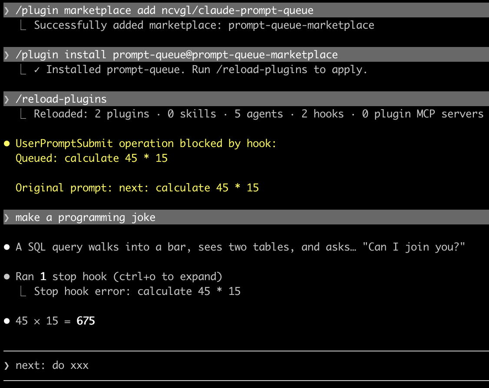

# claude-prompt-queue

Queue prompts in Claude Code. Type `next: <prompt>` to queue tasks that auto-execute after the current one finishes.



## Install & Usage

```
/plugin marketplace add ncvgl/claude-prompt-queue
/plugin install prompt-queue@prompt-queue-marketplace
next: do this
```

## How it works

- **UserPromptSubmit hook** — intercepts `next:` messages, writes them to a queue file, blocks them from reaching Claude
- **Stop hook** — when Claude finishes, reads the next item from the queue and injects it

## Limitations

- Queuing only works while Claude is idle (steering messages during processing bypass hooks)
- Queued prompts show as "Stop hook error" — cosmetic only, not an actual error
